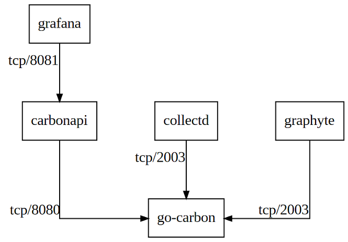

ansible role to install and configure carbonapi.

[][ci]
[][issues]
[][releases]

[ci]: https://github.com/bodsch/ansible-carbonapi/actions
[issues]: https://github.com/bodsch/ansible-carbonapi/issues?q=is%3Aopen+is%3Aissue
[releases]: https://github.com/bodsch/ansible-carbonapi/releases

Ansible Role for [carbonapi](https://github.com/go-graphite/carbonapi).
> golang reimplementation of API for graphite

*carbonapi* works between *grafana* as display-layer and *go-carbon* as storage engine.

## Operating systems

Tested on

* Debian 9 / 10
* Ubuntu 18.04 / 20.04
* CentOS 8
* OracleLinux 8

## Communication relationship



## usage

```
carbonapi_listen: '0.0.0.0:8088'

carbonapi_cache: {}

carbonapi_cpu: 0

carbonapi_graphite: {}

carbonapi_upstreams_backends:
  - "http://127.0.0.1:8081"

carbonapi_graph_templates: ''
carbonapi_expire_delay: 60

carbonapi_logger: {}
```

### upstreams

[upstream doc](https://github.com/go-graphite/carbonapi/blob/main/doc/configuration.md#upstreams)


### cache

[upstream doc](https://github.com/go-graphite/carbonapi/blob/main/doc/configuration.md#cache)

Valid types are `mem`, `memcache` or `null`.

Default are `mem`

```
carbonapi_cache:
  type: mem
  size_mb: 5
  default_timeout: 60
```

You can also use an Memcache cluster:

```
carbonapi_cache:
  type: memcache
  size_mb: 5
  default_timeout: 60
  memcached_servers:
    - 127.0.0.1:1234
    - 127.0.0.1:1235
    - 127.0.0.1:1236
```


### send internal metrics

[upstream doc](https://github.com/go-graphite/carbonapi/blob/main/doc/configuration.md#graphite)

```
carbonapi_graphite:
  host: '127.0.0.1:2003'
  interval: "60s"
  prefix: "carbon.api"
  pattern: "{prefix}.{fqdn}"
```

### define logging

[upstream doc](https://github.com/go-graphite/carbonapi/blob/main/doc/configuration.md#logger)

Available Loggers:

- `` - global for all
- `main` - what's before start
- `find` - for find handler
- `info` - for info handler
- `loadbalancer` - for lb handler
- `probe` - for background probes
- `render` - for render handler
- `slow` - slow query log ("Slow reuqest" messages)
- `access` - access logs (requests, times, etc)

Please note that if you want to have all logs going to stdout and access logs going to file,
you need to define 2 sections for access logger (file + stdout) + one section for logger ""

Loglevel can be "debug", "info", "warn", "error", "fatal", "panic"

```
carbonapi_logger:
  stderr:
    logger: ""
    file: "stderr"
    level: "warn"
    encoding: "console"
    encodingTime: "iso8601"
    encodingDuration: "seconds"
  logfile_main:
    logger: "main"
    file: /var/log/carbonapi/carbonapi_main.log
    level: debug
    encoding: "console"
```

## tests

```
$ tox -e py38-ansible29 -- molecule test
```


## install packages
https://packagecloud.io/go-graphite/stable/install#manual

## example configurations

under https://github.com/go-graphite/carbonapi/tree/0.12/cmd/carbonapi

https://github.com/go-graphite/carbonapi/blob/0.12/cmd/carbonapi/carbonapi.example.yaml
